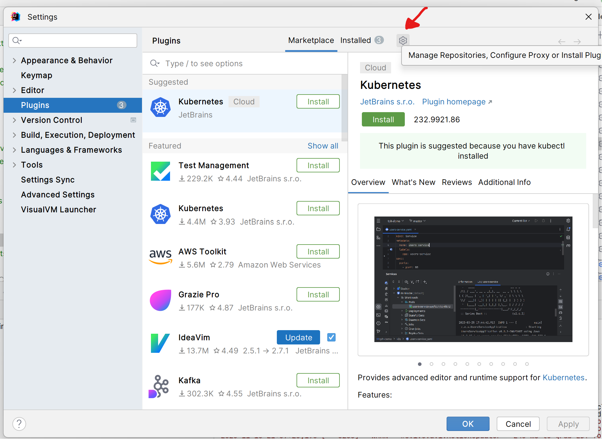

# Оборот в Ве крест крест

Плагин для заморской среды Си-Великокошки.

## Установка

1. Основные письмена находятся в хоромах `src` (ящерам вход наказан)
2. Поиск `.jar` бересты:
   * Для собора плагина из исходных материалов используйте `./gradlew build`
   * Вы можете использовать кулёк, выложенный на супостато-хранилище
3. Откройте Си-Великокошка
4. `ctrl + alt + s` -> `plugins` -> шестерня -> `Install Plugin from Disk`
5. Отыщите `.jar` бересту плагина
6. Дело сделано

## Оборот

1. `ctrl + alt + shift + b`